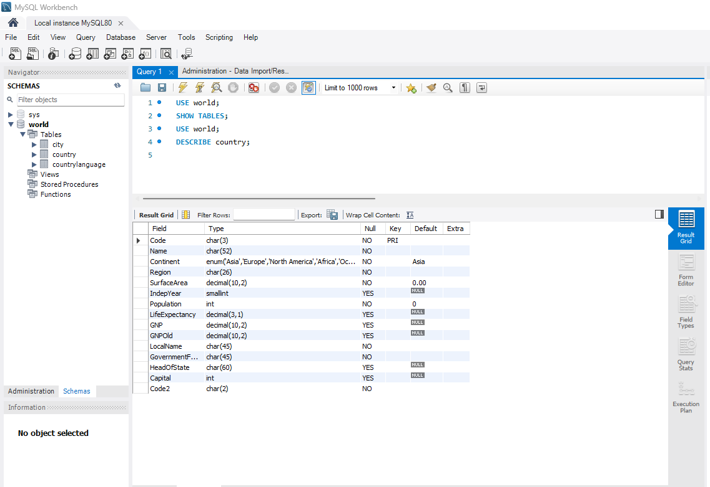
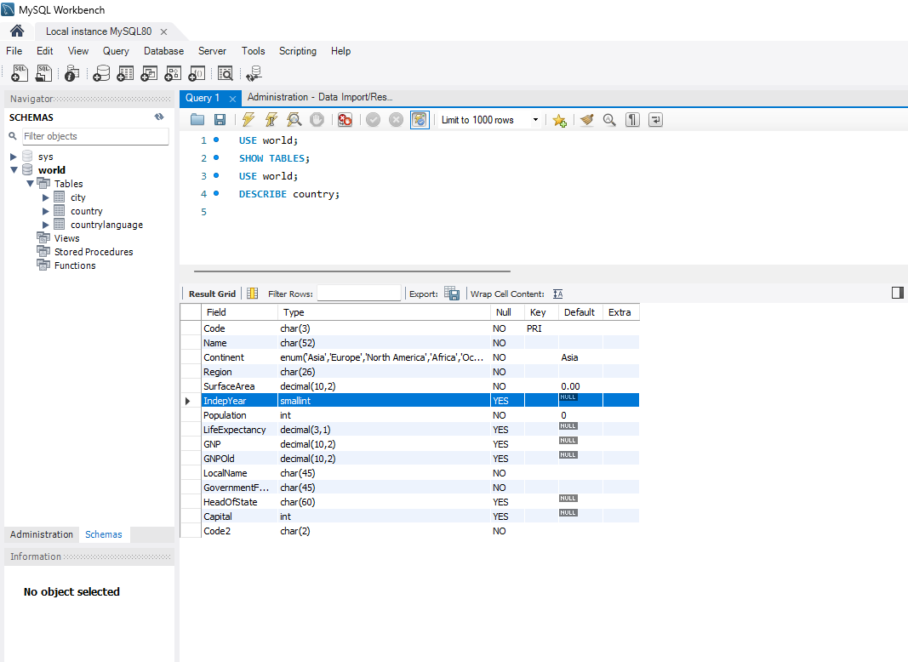
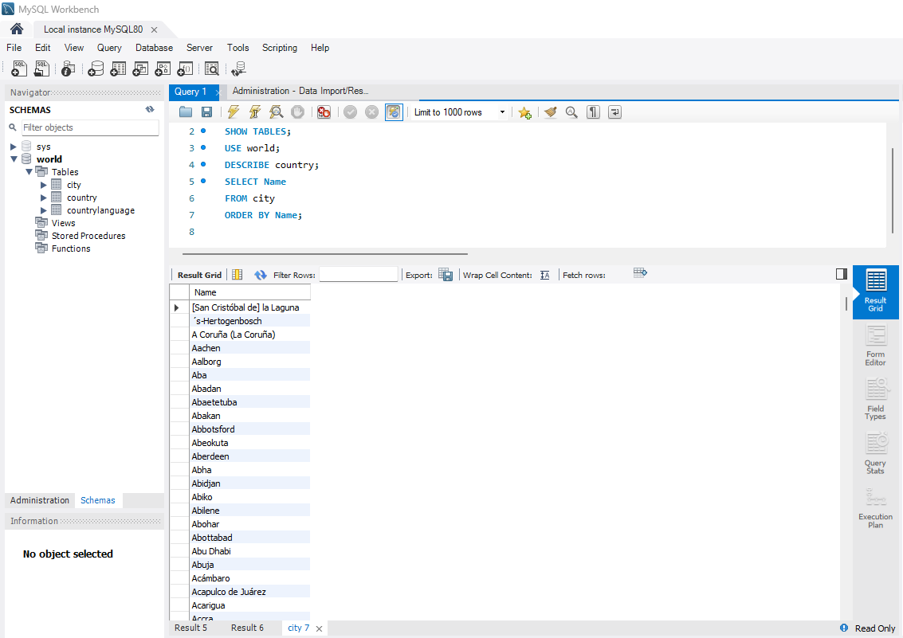
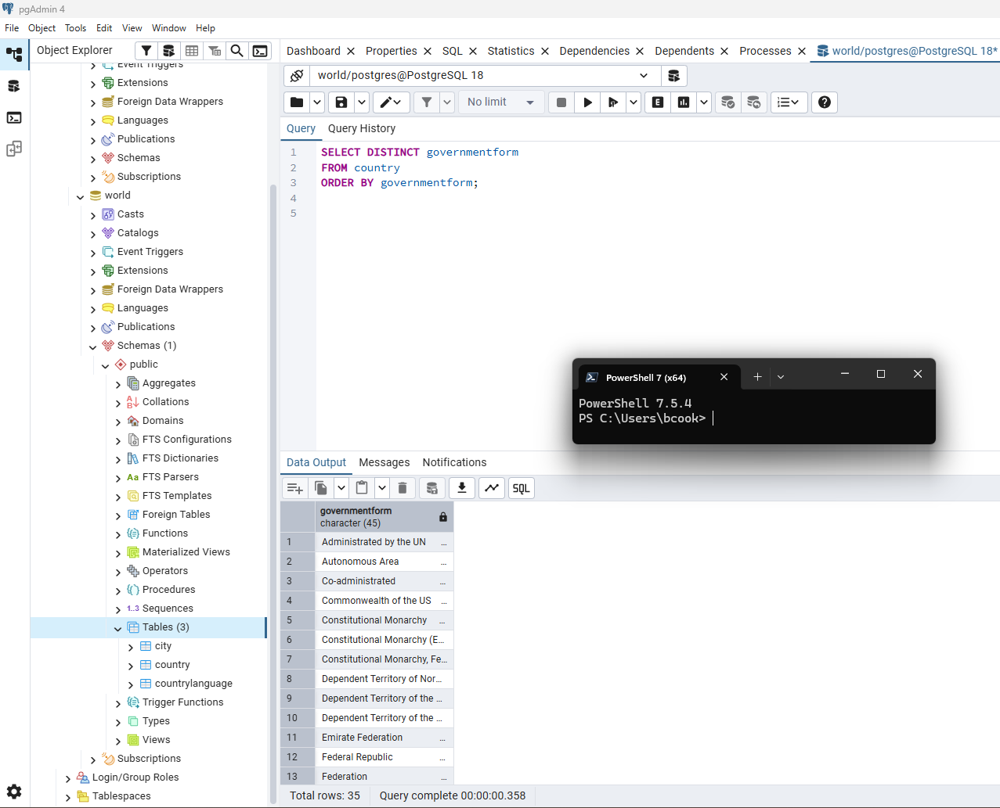
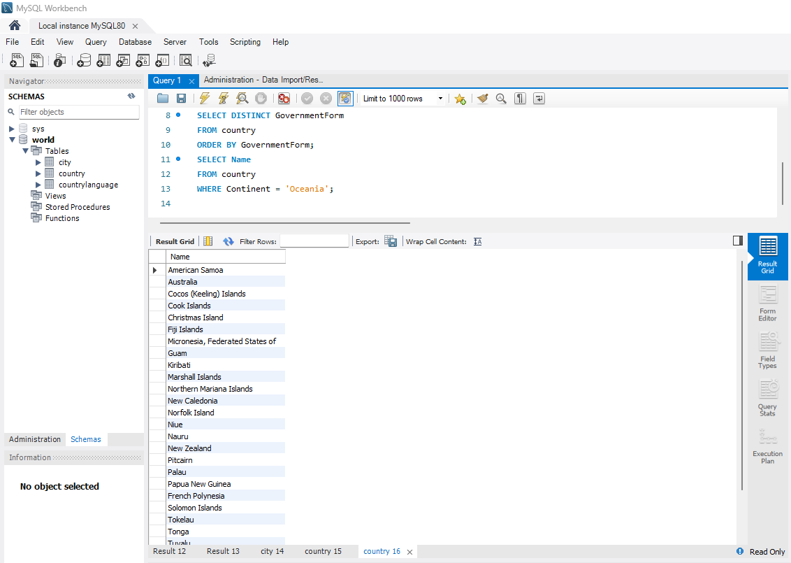
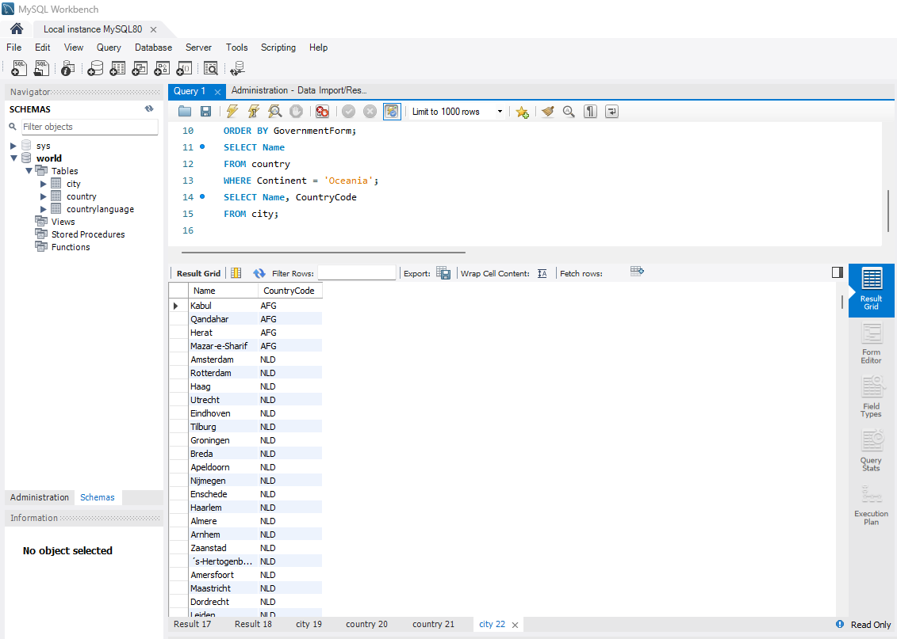
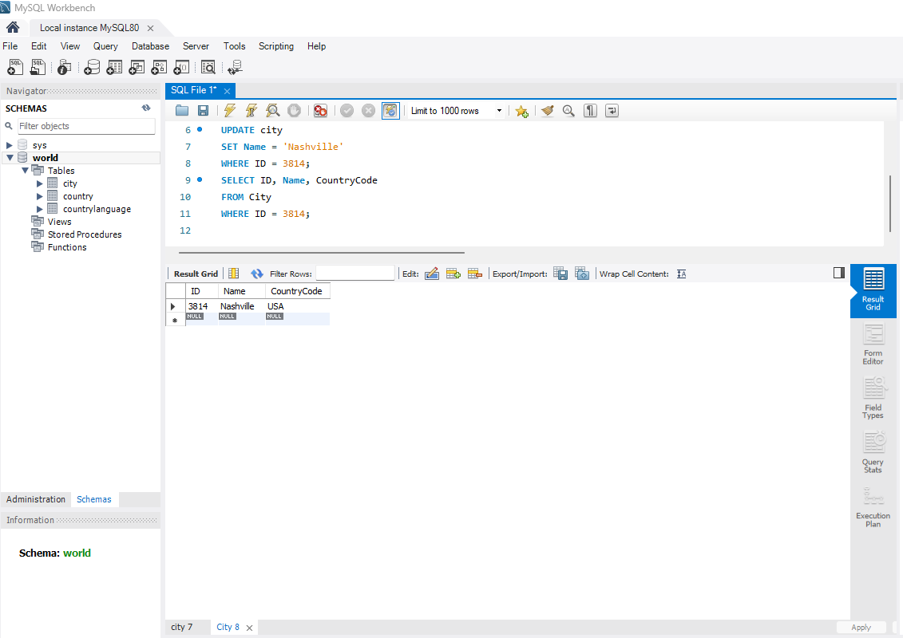
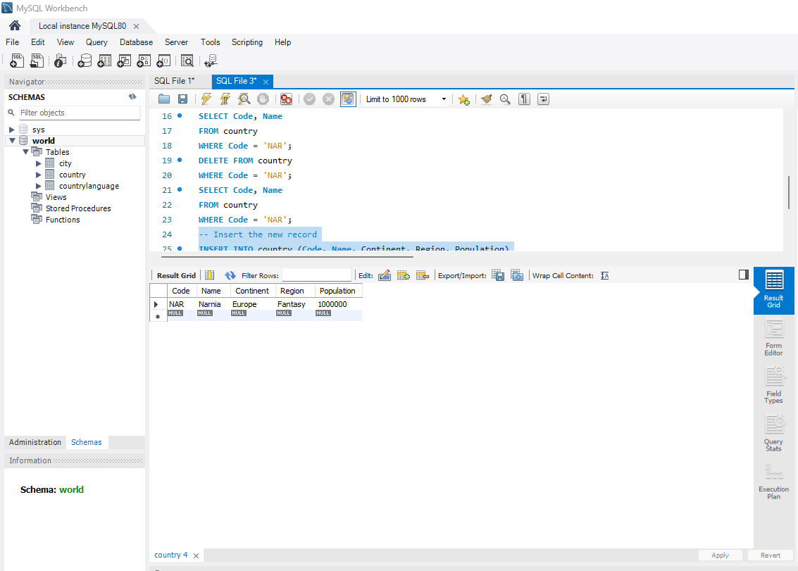
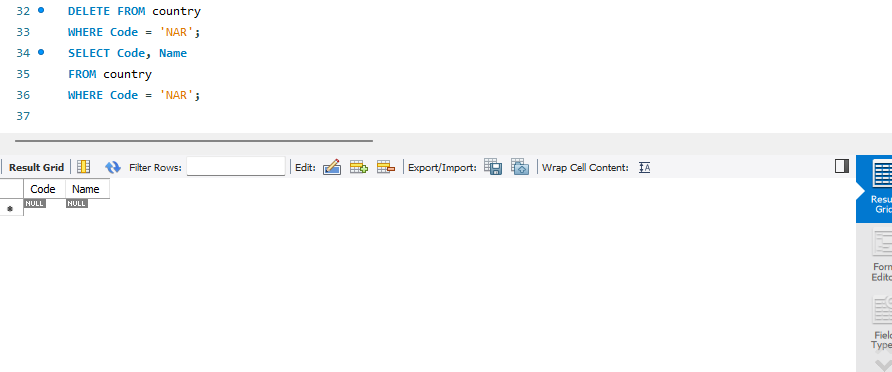

# Exercise 01: World Database SQL Practice

- Name:
- Course: Database for Analytics
- Module: 1
- Database Used: World Database

---

## Instructions

- Answer each question below.
- All SQL commands **must be executed** against the World database.
- For each SQL command:
  - Include the SQL in a fenced code block
  - Include a **screenshot** showing the command and results
- Store screenshots in the `screenshots/` folder and embed them below each answer.

---

## Question 1

**Compare and contrast the data types used for:**
- `country.Population`
- `country.LifeExpectancy`

Why were these data types selected?

### Answer
country.Population is stored as an INT because population represents a whole-number count of people. Integers are efficient for storage and computation and are well-suited for large numeric values without requiring decimal precision.
country.LifeExpectancy is stored as DECIMAL(3,1) because life expectancy is measured in years with fractional values (for example, 76.4 years). Using a fixed-point decimal preserves precision for these values.
Additionally, LifeExpectancy allows NULL values because data may be unavailable for some countries, whereas Population does not allow NULL since it is a required demographic attribute.


### Screenshot
_Show the table structure or DESCRIBE output._

```sql
DESCRIBE country;
```



---

## Question 2

**What is the data type of `country.IndepYear`?**
Why do you think this data type was selected?

### Answer
The data type of country.IndepYear is SMALLINT.
This data type was likely selected because independence years are represented as whole numbers and fall within a relatively small numeric range. A SMALLINT efficiently stores year values without using unnecessary storage space, unlike larger integer types. Additionally, the column allows NULL values, which makes sense because not all countries have a single, clearly defined year of independence. Using SMALLINT balances accuracy, storage efficiency, and flexibility for historical data.


### Screenshot

```sql
DESCRIBE country;
```



---

## Question 3

**Make a case for a different data type for `country.IndepYear`.**
Explain why your proposed data type might be better in some situations.

### Answer
An alternative data type for country.IndepYear could be YEAR instead of SMALLINT.
Using the YEAR data type may be preferable in situations where the column is strictly intended to represent a calendar year and not a more general numeric value. The YEAR type enforces valid year formatting, which can help prevent invalid or unrealistic entries and improve data integrity. It also makes the column’s purpose immediately clear to anyone reading the schema, enhancing readability and maintainability. In databases where date-related functions or time-based comparisons are frequently used, storing independence years as a YEAR could simplify queries and reduce ambiguity.


---

## Question 4

Write a SQL command to **list the names of all cities in alphabetical order**.

### SQL

```sql
SELECT Name
FROM city
ORDER BY Name;
```

### Screenshot



---

## Question 5

Write a SQL command to **list all forms of government from the `country` table**, showing **each only once**, sorted alphabetically.

### SQL

```sql
SELECT DISTINCT GovernmentForm
FROM country
ORDER BY GovernmentForm;
```

### Screenshot



---

## Question 6

Write a SQL command to **list all countries in the `Oceania` continent**.

### SQL

```sql
SELECT Name
FROM country
WHERE Continent = 'Oceania';
```

### Screenshot



---

## Question 7

Write a SQL command to **list the names and country code of all cities**.

### SQL

```sql
SELECT Name, CountryCode
FROM city;
```

### Screenshot



---

## Question 8

Write a SQL command to **update the city named `"Nashville-Davidson"` to `"Nashville"`**.

### SQL

```sql
UPDATE city
SET Name = 'Nashville'
WHERE Name = 'Nashville-Davidson';
```

### Screenshot



---

## Question 9

Write a SQL command to **insert a new country named `"Narnia"`** with a country code of `"NAR"`.
Use reasonable values for the remaining columns.

### SQL

```sql
INSERT INTO country (Code, Name, Continent, Region, Population)
VALUES ('NAR', 'Narnia', 'Europe', 'Fantasy', 1000000);
```

### Screenshot



---

## Question 10

Write a SQL command to **delete the country with the country code `"NAR"`**.

### SQL

```sql
DELETE FROM country
WHERE Code = 'NAR';
```

### Screenshot


