# Final Project – Database for Analytics

- Name: Brian Cookson  
- Course: Database for Analytics
- Moduel: 7  
- Assignment: Final Project 
- Tools Used: PostgreSQL 

---

# 1. Dataset Identification

## Objective
Identify the dataset selected for analysis and confirm its source format.

## Dataset
Flights Data (CSV)

### Screenshot

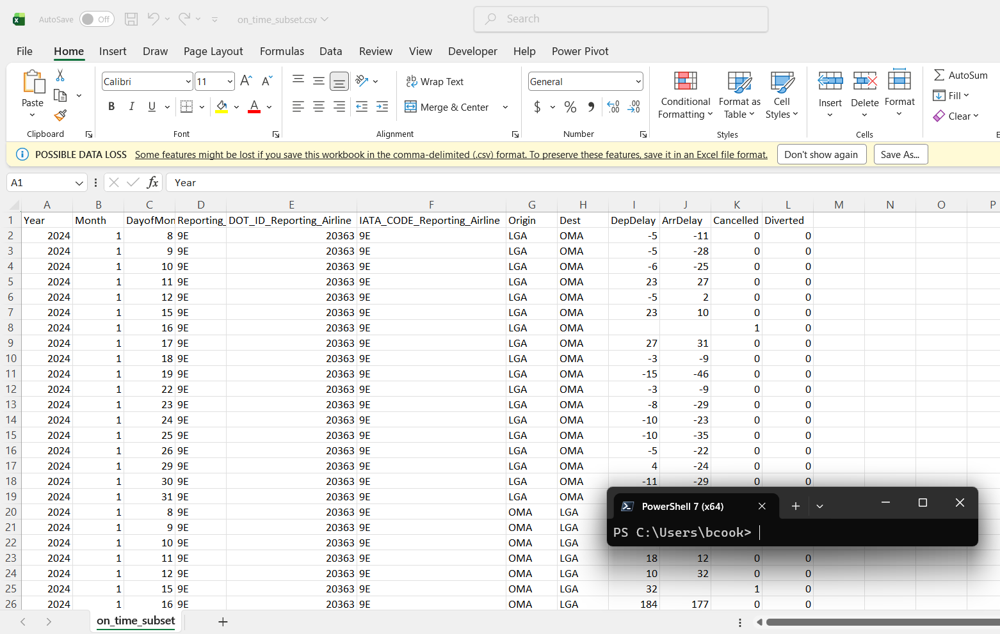

---

# 2. Database Setup

## Objective
Show the database created for this project and confirm the active connection.

### SQL

```sql
SELECT current_database();
```

### Screenshot

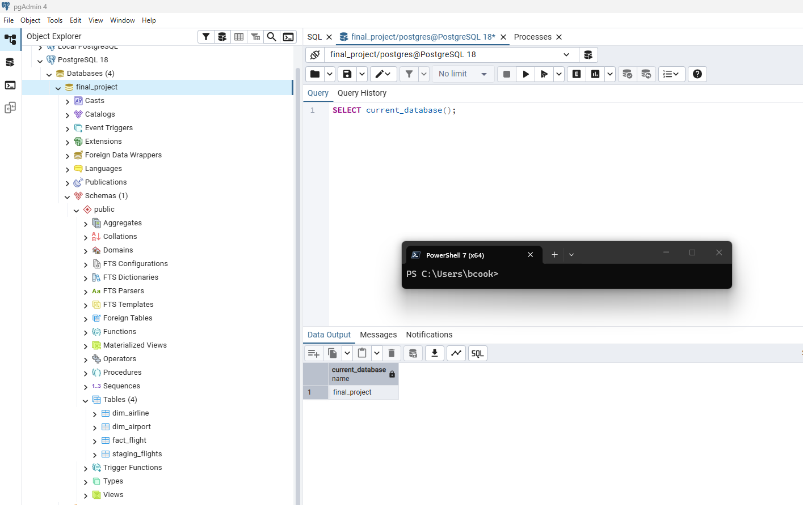

---

# 3. Table Structure

## Objective
Show the structure of all tables created for this project (staging and dimensional tables) and confirm column names and data types.

---

## 3.1 Staging Table – staging_flights

### SQL

```sql
SELECT column_name, data_type
FROM information_schema.columns
WHERE table_schema = 'public'
  AND table_name = 'staging_flights'
ORDER BY ordinal_position;
```

### Screenshot

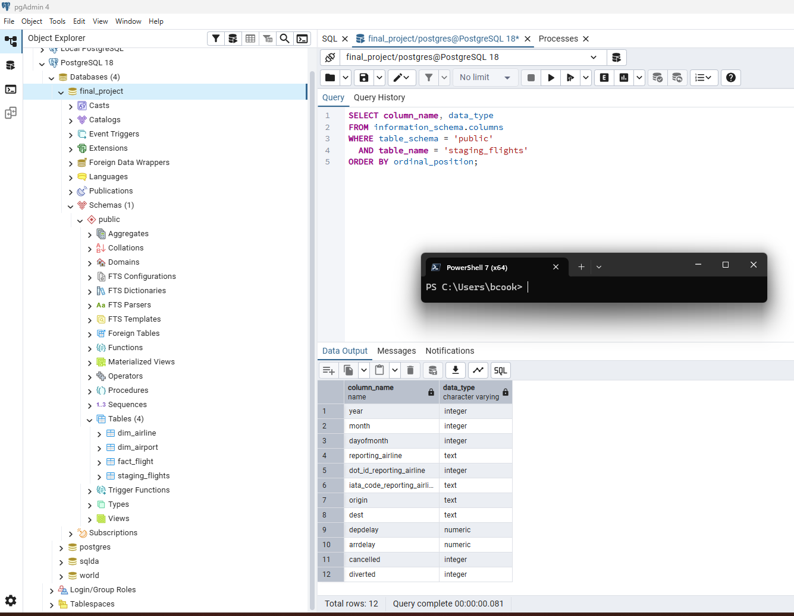

---

## 3.2 Dimension Table – dim_airline

### SQL

```sql
SELECT column_name, data_type
FROM information_schema.columns
WHERE table_schema = 'public'
  AND table_name = 'dim_airline'
ORDER BY ordinal_position;
```

### Screenshot

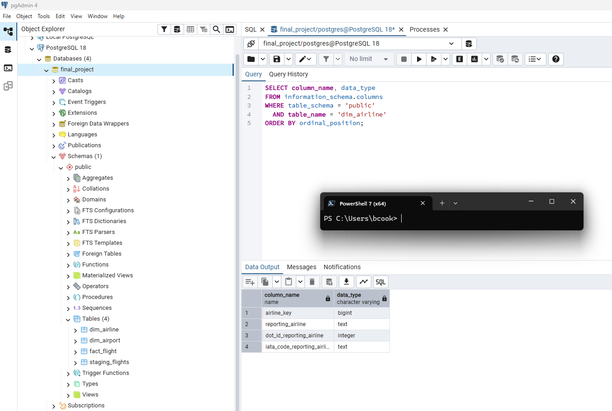

---

## 3.3 Dimension Table – dim_airport

### SQL

```sql
SELECT column_name, data_type
FROM information_schema.columns
WHERE table_schema = 'public'
  AND table_name = 'dim_airport'
ORDER BY ordinal_position;
```

### Screenshot

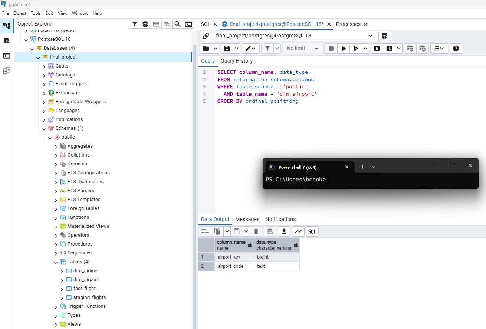

---

## 3.4 Fact Table – fact_flight

### SQL

```sql
SELECT column_name, data_type
FROM information_schema.columns
WHERE table_schema = 'public'
  AND table_name = 'fact_flight'
ORDER BY ordinal_position;
```

### Screenshot

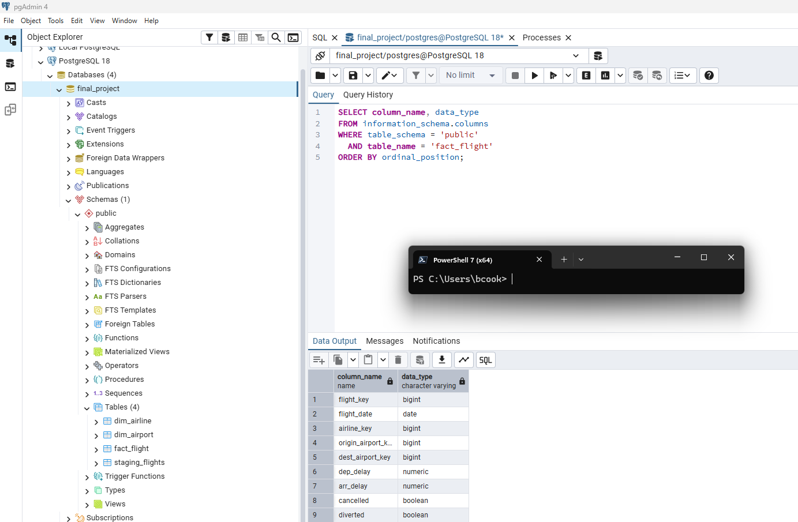

---

# 4. Table Row Counts

## Objective
Confirm that data has been successfully loaded by displaying the row count for each table.

### SQL

```sql
SELECT COUNT(*) AS staging_flights_count
FROM staging_flights;
```

```sql
SELECT COUNT(*) AS dim_airline_count
FROM dim_airline;
```

```sql
SELECT COUNT(*) AS dim_airport_count
FROM dim_airport;
```

```sql
SELECT COUNT(*) AS fact_flight_count
FROM fact_flight;
```

### Screenshots

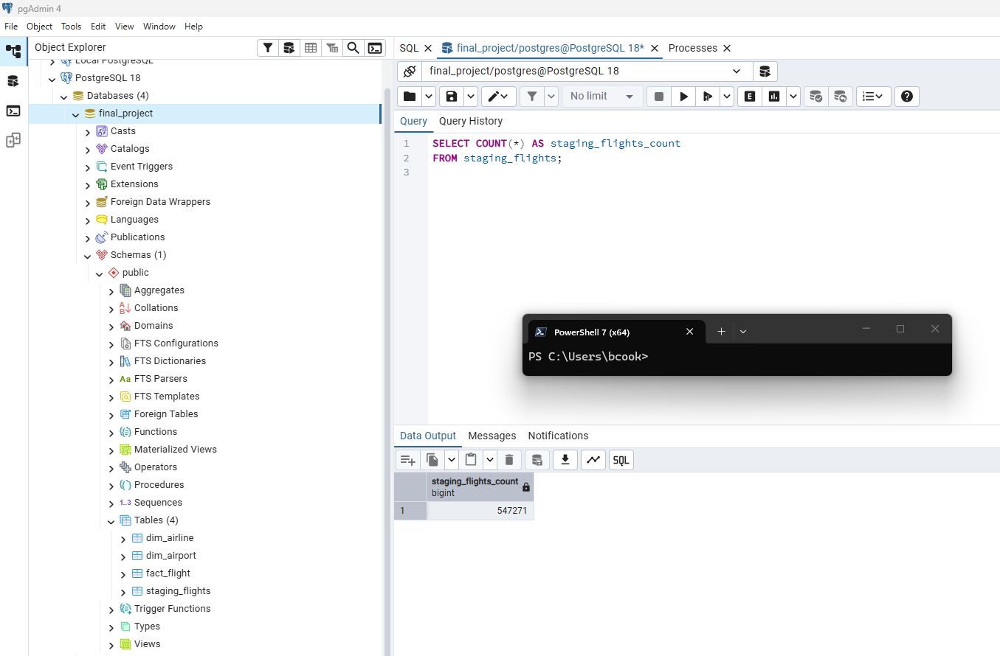
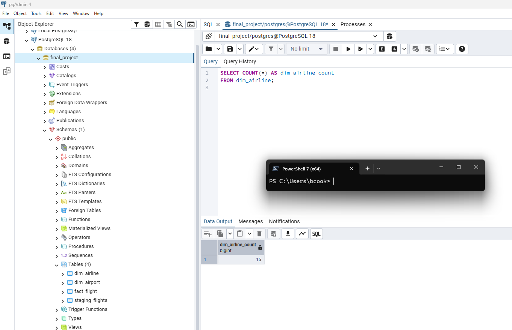
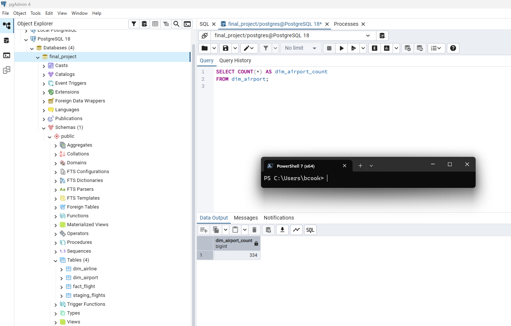
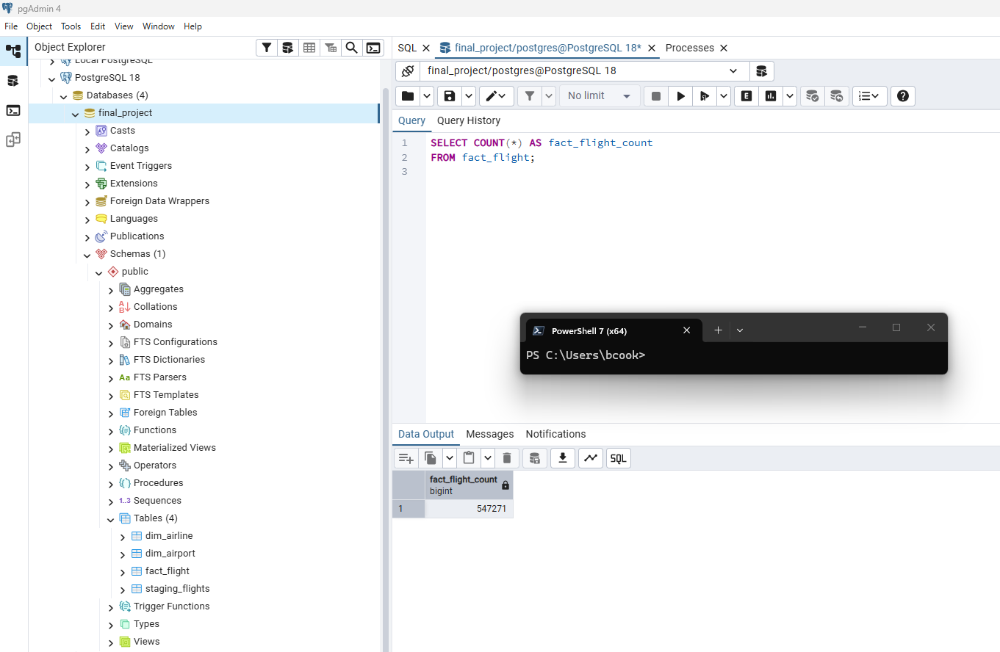

---

## 5. Queries and Results (Join + Aggregation)

## Objective
Demonstrate query results using the dimensional model. Include:
- At least one JOIN query
- At least one aggregated (GROUP BY) query

---

## 5.1 Join Query

### SQL
```SELECT
  f.flight_date,
  a.reporting_airline,
  a.iata_code_reporting_airline,
  o.airport_code AS origin_airport,
  d.airport_code AS dest_airport,
  f.dep_delay,
  f.arr_delay,
  f.cancelled,
  f.diverted
FROM fact_flight f
JOIN dim_airline a
  ON f.airline_key = a.airline_key
JOIN dim_airport o
  ON f.origin_airport_key = o.airport_key
JOIN dim_airport d
  ON f.dest_airport_key = d.airport_key
ORDER BY f.flight_date
LIMIT 25;
```

### Screenshot

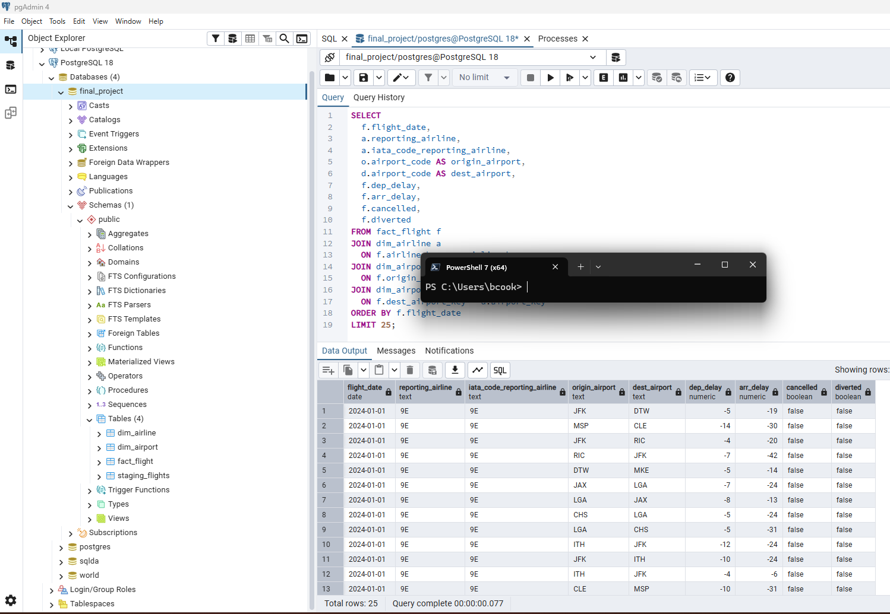

### SQL
```sql
SELECT
  a.reporting_airline,
  a.iata_code_reporting_airline,
  COUNT(*) AS total_flights,
  ROUND(AVG(f.arr_delay), 2) AS avg_arrival_delay,
  ROUND(AVG(f.dep_delay), 2) AS avg_departure_delay,
  ROUND(AVG(f.cancelled::int) * 100, 2) AS cancel_pct
FROM fact_flight f
JOIN dim_airline a
  ON f.airline_key = a.airline_key
GROUP BY a.reporting_airline, a.iata_code_reporting_airline
ORDER BY avg_arrival_delay DESC;
```

### Screenshot

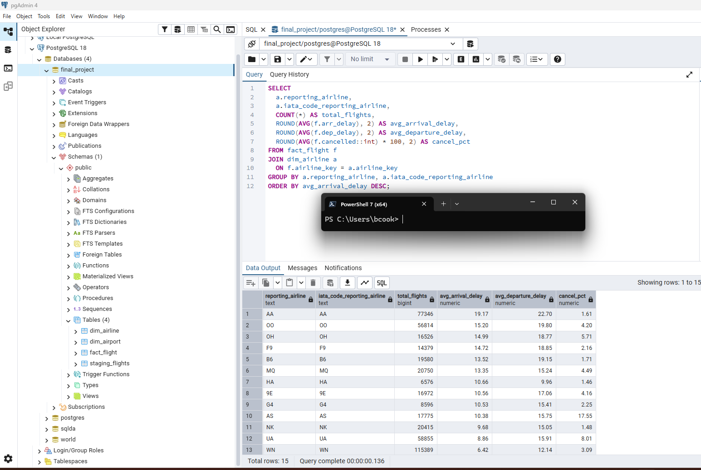

---

---

# 6. Data Preview (SELECT * Verification)

## Objective
Verify that data exists in each table by selecting sample records from the staging and dimensional tables.

---

## 6.1 Staging Table – staging_flights

### SQL
```sql
SELECT *
FROM staging_flights
LIMIT 10;
```

### Screenshot
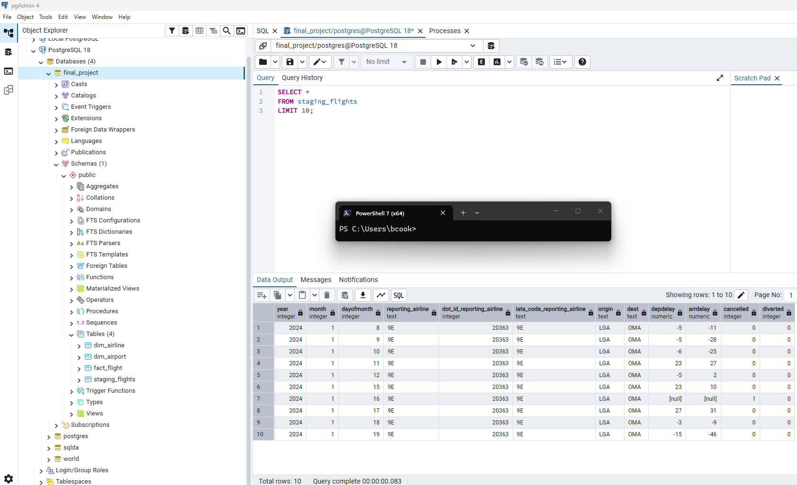

---

## 6.2 Dimension Table – dim_airline

### SQL
```sql
SELECT *
FROM dim_airline
LIMIT 10;
```

### Screenshot
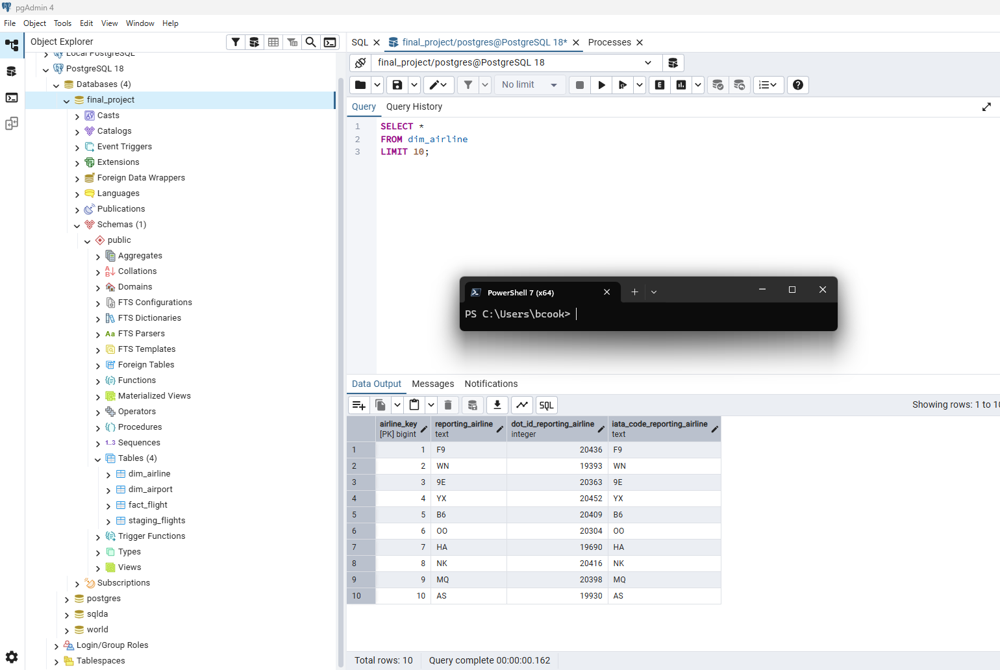

---

## 6.3 Dimension Table – dim_airport

### SQL
```sql
SELECT *
FROM dim_airport
LIMIT 10;
```

### Screenshot
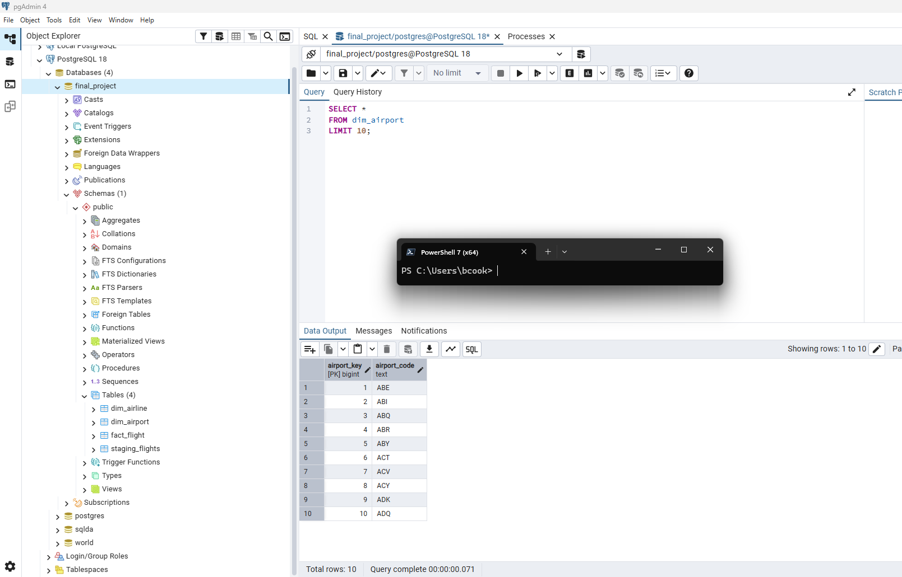

---

## 6.4 Fact Table – fact_flight

### SQL
```sql
SELECT *
FROM fact_flight
LIMIT 10;
```

### Screenshot
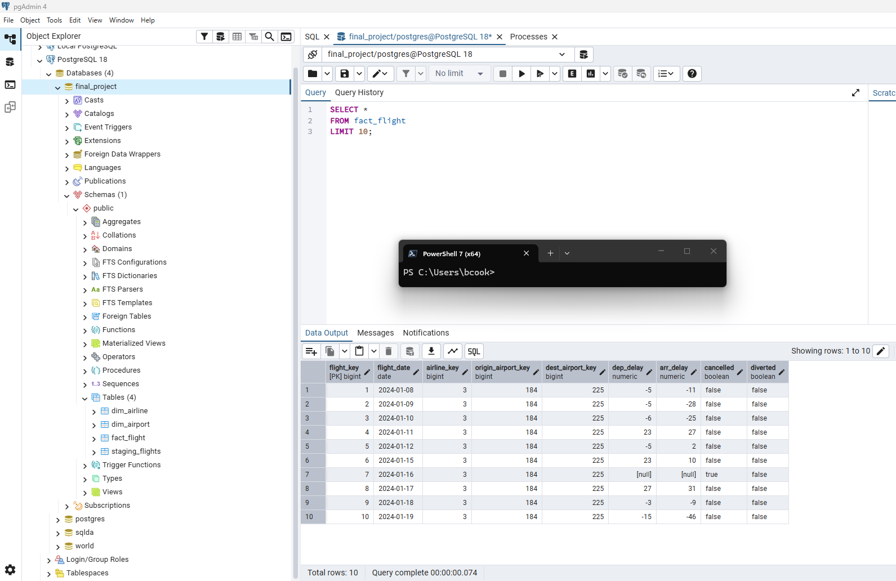

---

---

# 7. Data Dictionary

## Objective
Provide a structured business description of each table and its attributes, including data types and intended analytical meaning.

---

## 7.1 Staging Table – staging_flights

| Column Name | Data Type | Description |
|-------------|-----------|-------------|
| year | integer | Year of flight departure |
| month | integer | Month of flight departure (1–12) |
| dayofmonth | integer | Day of month flight departed |
| reporting_airline | text | Reporting airline carrier code |
| dot_id_reporting_airline | integer | U.S. DOT identifier for reporting airline |
| iata_code_reporting_airline | text | IATA airline carrier code |
| origin | text | Origin airport code |
| dest | text | Destination airport code |
| depdelay | numeric | Departure delay in minutes (negative = early) |
| arrdelay | numeric | Arrival delay in minutes (negative = early) |
| cancelled | integer | Indicator if flight was cancelled (1 = Yes, 0 = No) |
| diverted | integer | Indicator if flight was diverted (1 = Yes, 0 = No) |

---

## 7.2 Dimension Table – dim_airline

| Column Name | Data Type | Description |
|-------------|-----------|-------------|
| airline_key | bigint | Surrogate key for airline dimension |
| reporting_airline | text | Reporting airline code |
| dot_id_reporting_airline | integer | U.S. DOT airline identifier |
| iata_code_reporting_airline | text | IATA airline code |

---

## 7.3 Dimension Table – dim_airport

| Column Name | Data Type | Description |
|-------------|-----------|-------------|
| airport_key | bigint | Surrogate key for airport dimension |
| airport_code | text | Airport IATA code |

---

## 7.4 Fact Table – fact_flight

| Column Name | Data Type | Description |
|-------------|-----------|-------------|
| flight_key | bigint | Surrogate key for flight record |
| flight_date | date | Full calendar date of flight |
| airline_key | bigint | Foreign key referencing dim_airline |
| origin_airport_key | bigint | Foreign key referencing origin airport |
| dest_airport_key | bigint | Foreign key referencing destination airport |
| dep_delay | numeric | Departure delay in minutes |
| arr_delay | numeric | Arrival delay in minutes |
| cancelled | boolean | Indicates if flight was cancelled |
| diverted | boolean | Indicates if flight was diverted |

---

# 8. Data Transformation and Challenges

## Objective
Describe the data transformation process from raw CSV data to dimensional warehouse tables and explain any challenges encountered.

---

## 8.1 Data Transformation Steps

The raw flight data was initially loaded into a staging table (`staging_flights`) directly from the CSV file. From there, the following transformations were performed:

1. **Column Reduction**
   - Unnecessary columns were removed prior to import to simplify the data model.
   - Only fields required for analysis (date components, airline identifiers, airport codes, delays, and status flags) were retained.

2. **Date Construction**
   - The original dataset stored date values as separate fields (`year`, `month`, `dayofmonth`).
   - A proper `DATE` column (`flight_date`) was created in the fact table using:
     ```
     MAKE_DATE(year, month, dayofmonth)
     ```

3. **Dimensional Modeling**
   - Airline and airport reference data were separated into dimension tables:
     - `dim_airline`
     - `dim_airport`
   - Surrogate keys (`airline_key`, `airport_key`) were introduced to improve join efficiency and enforce referential integrity.

4. **Boolean Conversion**
   - The original dataset stored `cancelled` and `diverted` as integers (0/1).
   - These were converted to boolean values in the fact table for improved semantic clarity.

5. **Fact Table Creation**
   - A central `fact_flight` table was created to store measurable metrics:
     - Departure delay
     - Arrival delay
     - Cancellation flag
     - Diversion flag
   - Foreign keys were used to link the fact table to dimension tables.

---

## 8.2 Challenges Encountered

### 1. Data Type Alignment
Some fields imported as integers needed to be explicitly cast or converted to appropriate types (e.g., boolean values and constructed dates).

### 2. Maintaining Referential Integrity
Ensuring that all airline and airport values in the fact table matched dimension table keys required careful JOIN logic during insertion.

### 3. Large Row Volume
The dataset contained over 500,000 rows, which required attention to:
- Query execution time
- Efficient JOIN conditions
- Proper indexing through surrogate keys

### 4. Column Naming Consistency
Column names were standardized between staging and warehouse tables to maintain clarity and consistency.

---

## 8.3 Outcome

The final dimensional model successfully:
- Preserves all relevant analytical fields
- Separates descriptive attributes into dimensions
- Stores measurable metrics in a centralized fact table
- Supports efficient JOIN and aggregation queries

